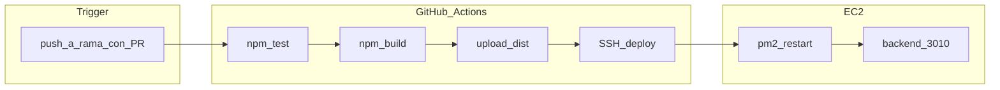

# Contexto

Conexión a AWS:
ssh -i .\claves_aws_micro.pem ec2-user@16.171.234.181  

# Prompt 1 - modo agent

analiza como experto en devops @README.md ya he conectado a mi máquina en AWS quiero configurar lo que me falta


#Prompt 2 - modo agent
Arregla el siguiente fallo ts-node en cli

PS C:\Users\USUARIO\Documents\desarrollo\LABS\Sesiones\Sesion 13\AI4Devs-pipeline\backend> ts-node seed.ts
ts-node : El término 'ts-node' no se reconoce como nombre de un cmdlet, 
función, archivo de script o programa ejecutable. Compruebe si escribió
correctamente el nombre o, si incluyó una ruta de acceso, compruebe que dicha   
ruta es correcta e inténtelo de nuevo.
En línea: 1 Carácter: 1
+ ts-node seed.ts
+ ~~~~~~~
    + CategoryInfo          : ObjectNotFound: (ts-node:String) [], CommandNotF  
   oundException
    + FullyQualifiedErrorId : CommandNotFoundException

# Prompt 2 - modo plan
Realiza el ejercicio
Tu misión en este ejercicio es crear un pipeline en GitHub Actions que, tras el trigger "push a una rama con un Pull Request abierto", siga los siguientes pasos:

Pase unos tests de backend.

Genere un build del backend.

Despliegue el backend en un EC2. 

Para ello, debes seguir estos pasos:

Configurar el workflow de GitHub Actions en un archivo .github/workflows/pipeline.yml.

# Plan a realizar

---
name: GitHub Actions Pipeline
overview: Crear `.github/workflows/pipeline.yml` con trigger en PR, jobs de test/build del backend en CI, y despliegue por SSH a EC2; incluir preparación inicial de la instancia (Docker, repo, PM2) que aún no está hecha.
todos:
  - id: ec2-bootstrap
    content: "Preparar EC2: Docker, clone repo, PostgreSQL, backend/.env, migrate, seed, PM2"
    status: pending
  - id: github-secrets
    content: "Configurar secretos en GitHub: EC2_INSTANCE, EC2_SSH_PRIVATE_KEY, EC2_USER, AWS_ACCESS_ID, AWS_ACCESS_KEY"
    status: pending
  - id: workflow-file
    content: Crear .github/workflows/pipeline.yml con jobs test, build y deploy (trigger pull_request synchronize)
    status: pending
  - id: validate-pr
    content: Abrir PR de prueba, verificar pipeline verde y backend respondiendo en EC2
    status: pending
isProject: false
---

# Pipeline GitHub Actions para backend en EC2

## Objetivo del ejercicio

Crear [`.github/workflows/pipeline.yml`](.github/workflows/pipeline.yml) que se dispare al **hacer push en una rama con PR abierto** y ejecute, en orden:

1. Tests de backend
2. Build de backend
3. Despliegue en EC2 (`16.171.234.181`, usuario `ec2-user`)



## Contexto del repo

- **Tests**: 4 archivos Jest en [`backend/src/`](backend/src/) con mocks de Prisma; no requieren PostgreSQL en CI.
- **Build**: `npm run build` (`tsc`) en [`backend/package.json`](backend/package.json); requiere `npx prisma generate` antes.
- **Runtime**: backend escucha en puerto **3010** ([`backend/src/index.ts`](backend/src/index.ts)), no 8080 como dice el README.
- **Prisma**: proyecto usa **Prisma 5.x**; en CI hay que fijar `npx prisma@5.13.0` para evitar el error de Prisma 7 visto en local.
- **Workflow actual**: no existe carpeta [`.github/workflows/`](.github/workflows/).

## Parte 1: Preparación inicial de EC2 (una sola vez)

Antes de que el pipeline funcione, preparar la instancia Amazon Linux 2023:

### 1.1 Instalar Docker y levantar PostgreSQL

```bash
sudo dnf install -y docker git
sudo systemctl enable --now docker
sudo usermod -aG docker ec2-user
# reconectar SSH
```

Clonar repo y levantar DB:

```bash
cd ~
git clone https://github.com/danigrz/AI4Devs-pipeline.git
cd AI4Devs-pipeline
# copiar .env con DB_USER, DB_PASSWORD, DB_NAME, DB_PORT (valores de backend/.env local)
docker compose up -d
```

### 1.2 Configurar backend en EC2

```bash
cd ~/AI4Devs-pipeline/backend
npm install
npx prisma@5.13.0 generate
npx prisma@5.13.0 migrate deploy
npm run seed
npm run build
```

Crear `backend/.env` en EC2:

```env
DATABASE_URL=postgresql://LTIdbUser:<password>@localhost:5432/LTIdb
```

### 1.3 Arrancar con PM2

```bash
pm2 start dist/index.js --name lti-backend
pm2 save
pm2 startup
```

Verificar:

```bash
curl http://localhost:3010/
# debe responder: Hola LTI!
```

### 1.4 Security Group

Abrir en AWS: **22** (SSH desde GitHub Actions), **3010** (API; opcional si solo pruebas internas). No exponer **5432**.

### 1.5 Clave SSH para GitHub Actions

Añadir en GitHub → Settings → Secrets and variables → Actions:

| Secreto | Valor |
|---------|-------|
| `EC2_INSTANCE` | `16.171.234.181` |
| `EC2_SSH_PRIVATE_KEY` | contenido completo de `claves_aws_micro.pem` |
| `EC2_USER` | `ec2-user` |
| `AWS_ACCESS_ID` | Access Key ID (requerido por README del curso) |
| `AWS_ACCESS_KEY` | Secret Access Key (requerido por README del curso) |

`EC2_SSH_PRIVATE_KEY` no está en el README pero es imprescindible para desplegar por SSH. Los secretos AWS se configurarán aunque el deploy use SSH (cumple requisito del README y deja margen para ampliar con SSM más adelante).

---

## Parte 2: Crear el workflow

Archivo: [`.github/workflows/pipeline.yml`](.github/workflows/pipeline.yml)

### Trigger

```yaml
on:
  pull_request:
    types: [opened, synchronize, reopened]
```

` synchronize` cubre exactamente el caso "push a una rama con PR abierto".

### Job `test`

- `runs-on: ubuntu-latest`
- `defaults.run.working-directory: backend`
- Pasos:
  1. `actions/checkout@v4`
  2. `actions/setup-node@v4` con `node-version: 16` (alineado con EC2)
  3. `npm ci`
  4. `npx prisma@5.13.0 generate`
  5. `npm test`

### Job `build` (depende de `test`)

- Mismos pasos de setup + `npm ci` + `prisma generate`
- `npm run build`
- `actions/upload-artifact@v4` subiendo `backend/dist/`

### Job `deploy` (depende de `build`)

- Descargar artifact `dist`
- Desplegar con [`appleboy/scp-action`](https://github.com/appleboy/scp-action) + [`appleboy/ssh-action`](https://github.com/appleboy/ssh-action):

**SCP**: copiar `dist/` al servidor en `~/AI4Devs-pipeline/backend/dist/`

**SSH** (script remoto):

```bash
cd ~/AI4Devs-pipeline
git fetch origin
git checkout ${{ github.head_ref || github.ref_name }}
git pull origin ${{ github.head_ref || github.ref_name }}
cd backend
npm ci --omit=dev
npx prisma@5.13.0 generate
npx prisma@5.13.0 migrate deploy
pm2 restart lti-backend || pm2 start dist/index.js --name lti-backend
pm2 save
curl -f http://localhost:3010/ || exit 1
```

Estrategia híbrida: el **build se valida en CI** (requisito del ejercicio) y el **deploy sincroniza código + dependencias** en EC2 para que Prisma y `node_modules` queden coherentes.

### Permisos y condiciones

- `permissions: contents: read` en el workflow.
- El job `deploy` solo corre si `test` y `build` pasan.
- Nota: en PRs desde forks, GitHub no expone secrets; para probar el pipeline, hacer push a una rama del propio repo `danigrz/AI4Devs-pipeline`.

---

## Parte 3: Validación del ejercicio

1. Crear rama `feature/pipeline` y abrir PR hacia `main`.
2. Hacer push a esa rama → debe ejecutarse el workflow.
3. En Actions, verificar jobs `test` → `build` → `deploy` en verde.
4. En EC2: `pm2 status` y `curl http://localhost:3010/`.
5. (Opcional) desde tu PC: `curl http://16.171.234.181:3010/` si el security group lo permite.

---

## Decisiones y riesgos

| Tema | Decisión |
|------|----------|
| Puerto backend | Usar **3010** (código real), no 8080 del README |
| Prisma en CI | Fijar `prisma@5.13.0` |
| Deploy | SSH + SCP (práctico con la `.pem` existente) |
| Frontend | Fuera de alcance del ejercicio (solo backend) |
| `claves_aws_micro.pem` | **No commitear**; solo como secreto `EC2_SSH_PRIVATE_KEY` |

## Archivos a crear/modificar

- **Crear**: [`.github/workflows/pipeline.yml`](.github/workflows/pipeline.yml) — workflow completo
- **Sin cambios de código** en backend/frontend para cumplir el ejercicio mínimo
- **Opcional posterior**: corregir URLs hardcodeadas del frontend y CORS para exposición pública vía Nginx (no requerido por este prompt)
